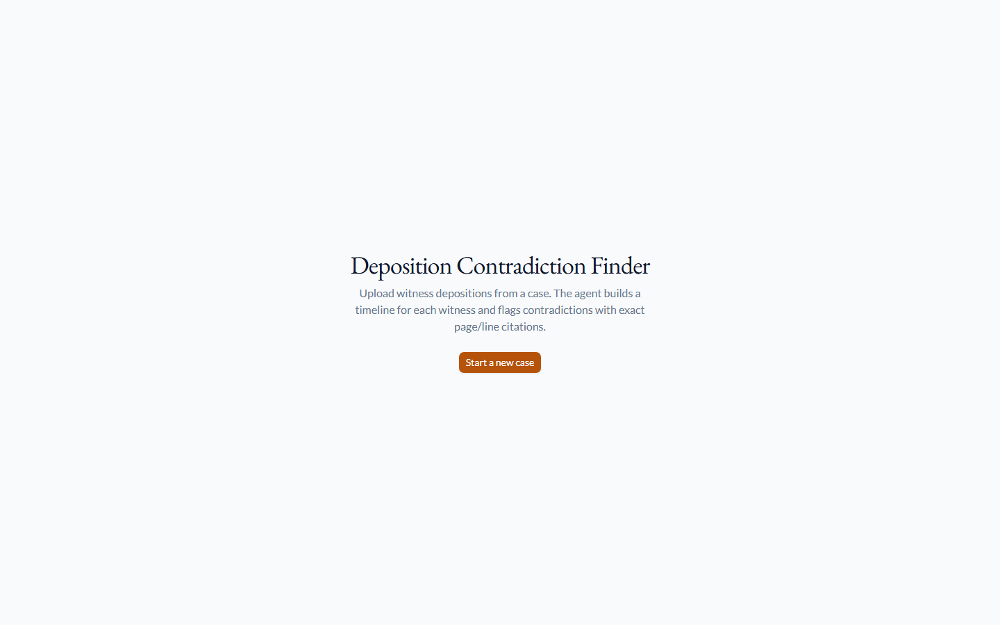
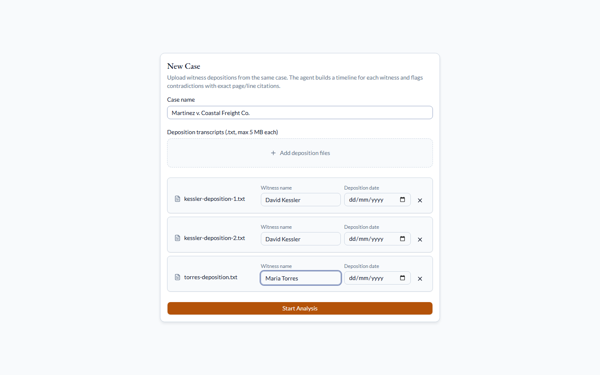
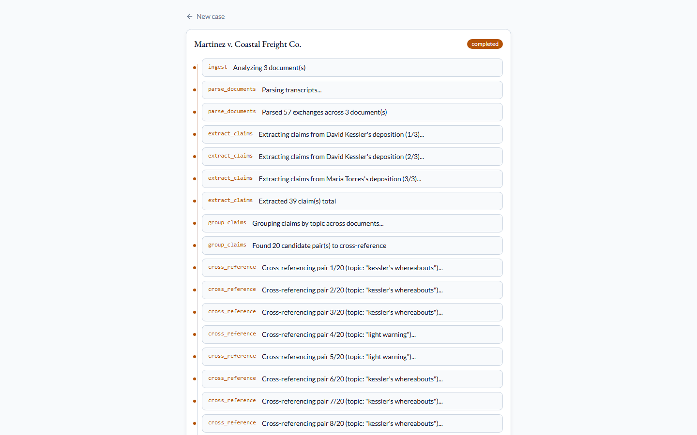
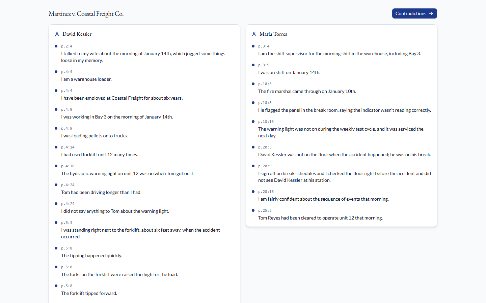
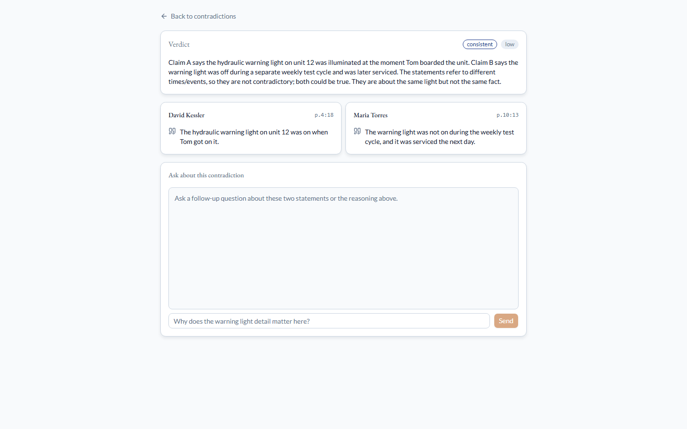
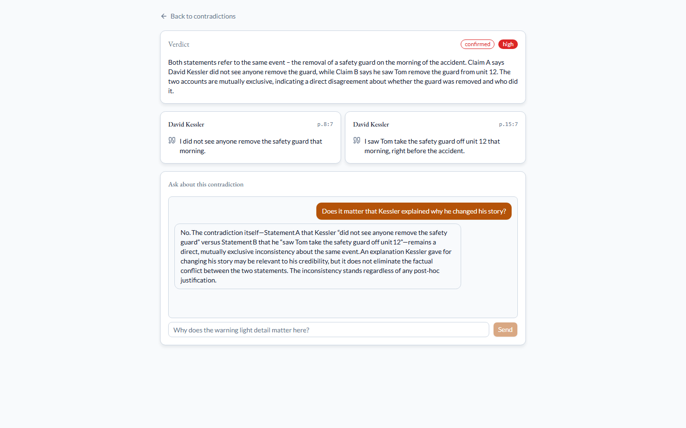
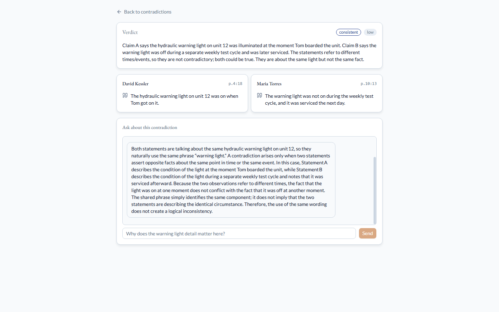
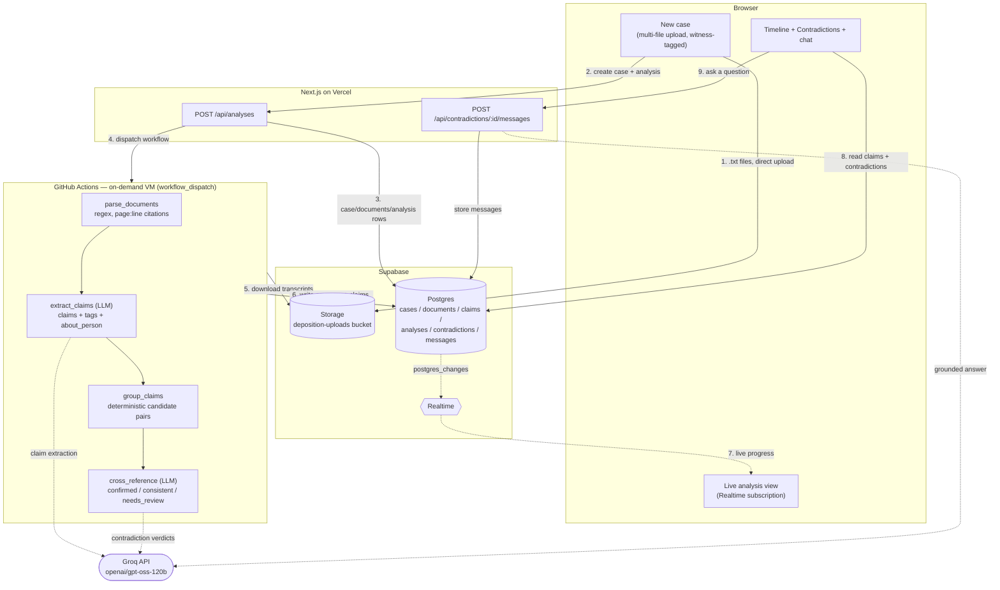

# Deposition Contradiction Finder

**Live app:** [deposition-contradiction-finder.vercel.app](https://deposition-contradiction-finder.vercel.app/)

An AI litigation-prep agent that ingests multiple witness depositions from the same case, builds a per-witness timeline, and cross-references statements across documents to flag contradictions — each one backed by exact page/line citations, not a vague summary.

The point isn't finding two statements that share a keyword — any text search does that. The point is telling the difference between statements that *genuinely* conflict and statements that merely *sound* alike on the surface but refer to different facts entirely. That distinction — a confirmed contradiction vs. a correctly-dismissed near-miss — is the whole product, and it requires real multi-document memory and structured comparison, not a single-pass chat response.

**Scope:** a litigation-prep research aid for depositions you upload. Not a substitute for attorney review, and not evidence of anything on its own.

## How it works

```
upload .txt transcripts (page:line format)
  → parse_documents (deterministic regex parser, real court-reporter citation format)
  → extract_claims (LLM, one call per document — discrete factual claims + topic tags + who each claim is about)
  → group_claims (deterministic — shared topic vocabulary or shared subject, zero extra LLM calls)
  → cross_reference (LLM, one call per candidate pair — confirmed / consistent / needs_review, with reasoning)
  → persist timelines + contradictions
```

`parse_documents` is the "Semgrep equivalent" here — a real, deterministic tool doing real work, not an LLM wrapper. Depositions follow the standard court-reporter `[page:line] Q./A. text` convention; a regex parser extracts exact `{page, line, speaker, text}` per exchange. The LLM never gets to invent a citation — it only ever refers to claims by an index into a list the parser already produced, and the real `{page, line}` is stitched back on afterward from the parser's own output. That trust boundary is deliberate: a citation in this product has to be something a court reporter's transcript actually says, not something an LLM remembered correctly.

The harder problem `group_claims` solves: a witness describing their *own* status rarely names themselves ("I was standing right next to the forklift"), while another witness describing that *same* person's status always does ("Kessler wasn't even on the floor"). No amount of tag-keyword tuning closes that gap — so `extract_claims` also tags each claim with an explicit `about_person` field, and grouping matches on that in addition to shared topic vocabulary.

## Screenshots

*All screenshots below are from the actual deployed app at the URL above, analyzing the real `fixture-case` test depositions — not mockups.*

**Upload witness depositions, tagged by name, watch it analyze live:**

| | |
|---|---|
|  |  |
|  |  |

**The "warning light" dismissal — the single strongest proof this is reasoning, not keyword matching.** Kessler describes the forklift's own hydraulic warning light being on the morning of the accident. Torres, four days earlier, describes a break-room fire-alarm panel's test-cycle indicator light *not* being on. Same phrase, opposite polarity — a naive matcher flags this instantly. The agent reads both statements in full and correctly dismisses it as `consistent`:



**A confirmed contradiction, with both cited statements side-by-side and the reasoning behind the verdict:**



**Chat follow-up, grounded in the two actual statements and the verdict reasoning** — a real question, answered by the same Groq model with this specific contradiction as context:



## Try it yourself

Fastest option: the case shown in every screenshot above is already live and fully analyzed — [timeline](https://deposition-contradiction-finder.vercel.app/cases/2ebb08ed-1655-4410-a2cd-6c987cc651b8/timeline) / [contradictions](https://deposition-contradiction-finder.vercel.app/cases/2ebb08ed-1655-4410-a2cd-6c987cc651b8/contradictions), no upload or wait required.

To run it yourself end to end:

1. Open [deposition-contradiction-finder.vercel.app](https://deposition-contradiction-finder.vercel.app/) → **Start a new case**.
2. Upload the three `.txt` transcripts in [`fixture-case/`](fixture-case/) — tag `kessler-deposition-1.txt` and `kessler-deposition-2.txt` as witness **David Kessler**, `torres-deposition.txt` as **Maria Torres**.
3. Watch the analysis run live, then open the timeline and contradictions.
4. Check your results against [`fixture-case/ANSWER_KEY.md`](fixture-case/ANSWER_KEY.md) — it documents the 3 expected headline findings and *why* each verdict is correct, including the warning-light near-miss above.

Analyses run as on-demand GitHub Actions jobs (see [Architecture](#architecture) below), so expect roughly 1–3 minutes from submit to `completed`, depending on document length and Groq response time.

## Architecture



| Layer | Tech | Why |
|---|---|---|
| Frontend | Next.js 16 (App Router) + Tailwind v4 + shadcn/ui + Motion | Vercel, free Hobby tier |
| Persistence + Realtime | Supabase (Postgres + Storage + Realtime) | Free tier; browser subscribes to analysis progress via Realtime instead of a fragile SSE proxy |
| Agent harness | LangGraph, Python | `ingest → parse_documents → extract_claims → group_claims → cross_reference → persist_findings` |
| Transcript parsing | Custom regex parser, `[page:line] Q./A.` format | Deterministic ground-truth citations — the LLM never invents a page/line, it only indexes into what the parser already extracted |
| Topic/subject grouping | Pure Python (`grouping.py`) | Bounds `cross_reference` LLM calls to only groups with a real cross-document match; zero extra LLM cost |
| LLM | Groq (`openai/gpt-oss-120b`) | Genuinely free tier, no card — see below for why this specific model, not the originally planned one |
| Agent compute | GitHub Actions (`workflow_dispatch`) | Free, no-card, real Ubuntu VM — same pattern proven on the earlier Exploit-Path-Tracer build, applied here from day one instead of rediscovered |

**Why this specific Groq model, not a smaller/faster one:** the original plan used `llama-3.3-70b-versatile`, but it hit its daily token quota mid-build before it could be properly evaluated. Its replacement, `llama-3.1-8b-instant`, ran clean but its *reasoning* turned out to be the real problem: on a full test run it called a witness's "I'm a warehouse loader" a contradiction of another witness's "he was on his break," reasoning that a job-title claim "implies presence." That's exactly the naive pattern-matching failure this product exists to catch — a model that makes that mistake itself is disqualifying for the task, not just noisier. `openai/gpt-oss-120b` was checked directly against four hand-picked pairs (the two genuine contradictions, the warning-light near-miss, and the specific job-title-vs-whereabouts pair the smaller model got wrong) before being trusted with a full run — all four came back correct. Full log in [`PLAN.md`](PLAN.md#verification-notes--corrections-added-on-review).

## Repo structure

```
apps/
  web/            Next.js frontend → Vercel
  agent/          LangGraph harness → runs as a GitHub Actions job
fixture-case/     3 real deposition transcripts + ANSWER_KEY.md
supabase/         schema.sql
docs/screenshots/ Real screenshots from the live deployment, used above
PLAN.md           Full build log: architecture decisions, every real bug found, every verification step
```

## Environment variables

`apps/web/.env.local`: `NEXT_PUBLIC_SUPABASE_URL`, `NEXT_PUBLIC_SUPABASE_PUBLISHABLE_KEY`, `SUPABASE_SECRET_KEY`, `GITHUB_TOKEN`, `GROQ_API_KEY`
`apps/agent/.env` (local dev only): `GROQ_API_KEY`, `GROQ_MODEL`, `SUPABASE_URL`, `SUPABASE_SERVICE_ROLE_KEY`

See [`PLAN.md`](PLAN.md) for the full architecture doc and a running log of every verification step and real bug found along the way — that's the honest build history, not a retrospective summary.
